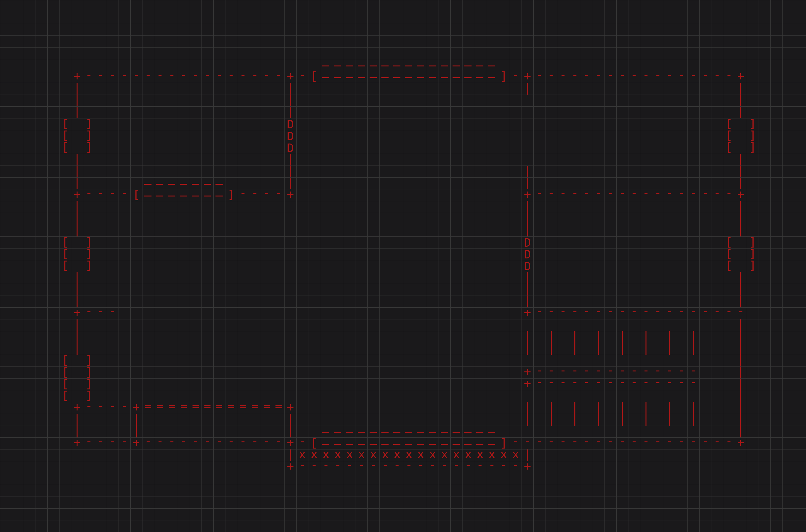

# ASCII MAPPER
```
  ______    ______    ______   ______  ______                  
 /      \  /      \  /      \ /      |/      |                 
/$$$$$$  |/$$$$$$  |/$$$$$$  |$$$$$$/ $$$$$$/                  
$$ |__$$ |$$ \__$$/ $$ |  $$/   $$ |    $$ |                   
$$    $$ |$$      \ $$ |        $$ |    $$ |                   
$$$$$$$$ | $$$$$$  |$$ |   __   $$ |    $$ |                   
$$ |  $$ |/  \__$$ |$$ \__/  | _$$ |_  _$$ |_                  
$$ |  $$ |$$    $$/ $$    $$/ / $$   |/ $$   |                 
$$/   $$/  $$$$$$/   $$$$$$/  $$$$$$/ $$$$$$/                  
                                                               
                                                               
                                                               
 __       __   ______   _______   _______   ________  _______  
/  \     /  | /      \ /       \ /       \ /        |/       \ 
$$  \   /$$ |/$$$$$$  |$$$$$$$  |$$$$$$$  |$$$$$$$$/ $$$$$$$  |
$$$  \ /$$$ |$$ |__$$ |$$ |__$$ |$$ |__$$ |$$ |__    $$ |__$$ |
$$$$  /$$$$ |$$    $$ |$$    $$/ $$    $$/ $$    |   $$    $$< 
$$ $$ $$/$$ |$$$$$$$$ |$$$$$$$/  $$$$$$$/  $$$$$/    $$$$$$$  |
$$ |$$$/ $$ |$$ |  $$ |$$ |      $$ |      $$ |_____ $$ |  $$ |
$$ | $/  $$ |$$ |  $$ |$$ |      $$ |      $$       |$$ |  $$ |
$$/      $$/ $$/   $$/ $$/       $$/       $$$$$$$$/ $$/   $$/ 
                                                               
```                                      
**ASCII Mapper** is a small visual tool that converts ASCII text maps into clean, grid-aligned images.

No scripting. No command line. Just type ASCII → get a PNG.

Was created to make stylized maps for the TTRPG Cyberpunk 2020

---

## ✨ What It Does

- Converts ASCII text into a **grid-based image**
- Each character becomes a **cell**
- Optional **grid lines** between cells
- **Live preview** while you edit
- **Pan & zoom** the rendered map
- **Export to PNG** for sharing or use in other tools

---

## 🧠 Core Features

### 📝 Live ASCII Editor
Edit your ASCII map directly in the app and see changes immediately.

###########
#.........#
#..###....#
#..#.#....#
#..###....#
#.........#
###########


### 🎨 Visual Customization
- Background color picker
- Foreground (text) color picker
- Grid color picker
- Adjustable font size and cell size
- Adjustable grid thickness

### 🔍 Preview Controls
- Mouse wheel zoom
- Click-and-drag panning
- Scrollbars for large maps

### 🔁 Replace Characters Tool
Quickly replace characters across the map.

Example:
- Replace `.` → `·`
- Replace `#` → `█`
- Replace only within a selection or the entire map

### 💾 File Support
- Load `.txt` ASCII maps
- Save edited ASCII back to disk
- Export rendered image as `.png`

### 🔤 Font Control
- Uses monospace fonts for perfect alignment
- Option to choose a custom font file (`.ttf`, `.otf`)

---

## 🖼 Example Outputs



